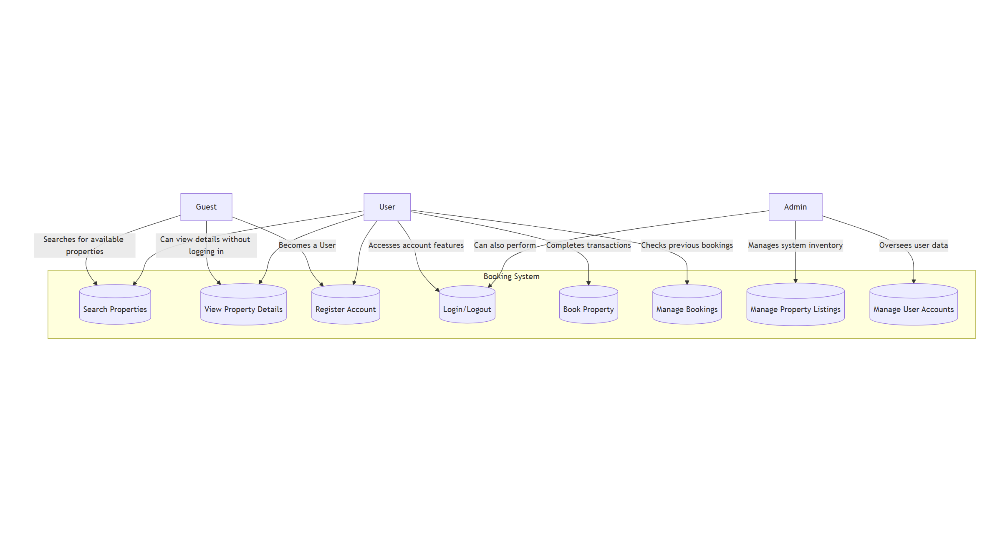

# Requirement Analysis in Software Development.

## ❓ What is Requirement Analysis?

**Requirement Analysis** is the systematic process of **identifying, understanding, documenting, and managing** the needs and objectives of stakeholders to determine the characteristics of a new or modified software system.

It is a crucial preliminary stage in the Software Development Life Cycle (**SDLC**) that translates vague business goals into a precise set of **functional** (what the system must do) and **non-functional** (how well the system must perform) specifications.

### Importance in the SDLC

Requirement Analysis is often considered the most critical phase due to its impact on overall project success:

* **Risk Mitigation:** Catching errors or ambiguities in requirements early is exponentially cheaper than fixing them later in development.
* **Scope Control:** It clearly defines the **project scope**, preventing uncontrolled expansion known as **scope creep**.
* **Quality Assurance:** It provides the concrete foundation needed to design, develop, and, most importantly, **test** the final product against stakeholder expectations.
* **Alignment:** It ensures the entire development team is working towards the same, validated business objectives.

## 💡 Why is Requirement Analysis Important?

Requirement Analysis is the bedrock of a successful software project. Skipping or performing it poorly almost inevitably leads to project failure, budget overruns, and dissatisfied stakeholders.

Here are three critical reasons why it is essential:

* **Cost & Risk Mitigation**
    * The cost of fixing an error increases exponentially the later it is discovered in the SDLC. By investing time upfront to analyze and validate requirements, organizations dramatically reduce the risk of building the **wrong product** and avoid expensive, last-minute changes during coding or testing.

* **Scope Control & Clarity**
    * It establishes a clear, agreed-upon boundary for the project—the **project scope**. This process prevents "scope creep," where new, unmanaged features are constantly added. A well-defined scope keeps the team focused, on budget, and on schedule.

* **Foundation for Testing & Quality**
    * Requirements serve as the primary criteria for project success. They provide the basis for all **test cases** and **acceptance criteria**. If the requirements are vague, testing cannot be definitive, making it impossible to confidently deliver a high-quality product that meets the user's actual needs.
 
## ⚙️ Key Activities in Requirement Analysis

Requirement Analysis is a multi-step process that ensures a complete, correct, and unambiguous set of needs is defined before development begins. These activities often overlap and are iterated upon throughout the project.

* **Requirement Gathering**
    * This is the initial, broad effort to collect all potential needs, wants, and constraints from every relevant **stakeholder** (users, customers, business owners, etc.) concerning the new system. The goal is to cast a wide net to understand the complete context of the problem being solved.

* **Requirement Elicitation**
    * This activity focuses on actively extracting detailed, specific requirements from stakeholders using structured techniques. Common methods include **interviews**, **brainstorming sessions**, **surveys**, **prototyping**, and observing users in their current work environment.

* **Requirement Documentation**
    * The elicited and analyzed requirements must be formally recorded in a clear, unambiguous, and traceable manner. This typically results in a **Software Requirements Specification (SRS)** document, or in Agile contexts, a prioritized **Backlog** of **User Stories** and acceptance criteria.

* **Requirement Analysis and Modeling**
    * This is where requirements are refined, prioritized, and checked for conflicts, ambiguity, and completeness. **Modeling** techniques (like Use Case diagrams, Data Flow Diagrams, and prototypes) are used to visually represent the requirements, showing how the system will interact with users and other systems.

* **Requirement Validation**
    * The final set of documented and modeled requirements are reviewed to ensure they are **testable**, **achievable**, and truly address the original **business problem** and stakeholder needs. Validation is critical for securing stakeholder sign-off before the design and coding phases begin.

## 🏷️ Types of Requirements

Requirements are broadly categorized into two types, which collectively define the complete scope of the software system.

### Functional Requirements (FRs)

**Functional Requirements** specify **what the system must do**—the features, functions, and behaviors that the user interacts with directly to achieve a business objective. They are concerned with the direct interaction between the user and the system.

| Definition | Examples (Online Event Booking System) |
| :--- | :--- |
| Describe the specific actions or tasks the system must perform. | *The system **must allow** users to search for events by date, category, and location.* |
| Focus on the core business logic and user-facing features. | *The system **must process** credit card payments through a third-party gateway.* |
| Are essential for the system to fulfill its primary purpose. | *The system **must generate and email** a confirmation ticket with a QR code upon successful booking.* |

### Non-functional Requirements (NFRs)

**Non-functional Requirements** specify **how the system must be**—the criteria used to judge the operation of the system, rather than specific behaviors. They define quality attributes like performance, security, reliability, and usability.

| Definition | Examples (Online Event Booking System) |
| :--- | :--- |
| Describe the quality attributes, constraints, and design limitations. | *The system **must load** the event listing page within **2 seconds** for 95% of all requests (Performance).* |
| Focus on the user experience, design, and technical environment. | *The system **must be available** 99.9% of the time during peak business hours (Availability).* |
| Are critical for user satisfaction, maintainability, and security. | *The system **must encrypt** all user passwords and stored payment information using AES-256 (Security).* |

## 🖼️ Use Case Diagrams

**Use Case Diagrams** are a type of behavioral diagram in the **Unified Modeling Language (UML)** used during Requirement Analysis. They graphically represent the functions (use cases) of a system and the way external users (actors) interact with those functions. They serve as a high-level visual summary of the system's intended behavior from the user's perspective.

### Benefits in Requirement Analysis

* **System Boundary Definition:** They clearly define the **scope** of the system by showing what functions are included and which are external to it.
* **Stakeholder Communication:** They provide a simple, easily understandable visual tool that non-technical stakeholders can use to validate that the proposed system actions align with their business needs.
* **Foundation for Detail:** Each use case bubble in the diagram typically corresponds to a detailed **use case description** (a document or user story), which forms the core of the functional requirements.

### Example Diagram

The following diagram illustrates the primary functions and actors for a simplified booking system:

## ✅ Acceptance Criteria

**Acceptance Criteria (AC)** are formal conditions that a software feature or user story must satisfy to be deemed complete and acceptable by the user, client, or Product Owner. They act as a critical bridge between high-level requirements and testable, verifiable outcomes.

### Importance in Requirement Analysis

* **Define "Done":** ACs explicitly clarify the boundaries of a requirement, eliminating ambiguity about when the development work on a specific feature is truly finished. They transform abstract needs into concrete goals.
* **Basis for Testing:** They translate requirements directly into executable tests. If a system passes all acceptance criteria, it has functionally met the stakeholder's need. The QA team uses these criteria to design their test cases.
* **Prevent Scope Creep:** They provide a sign-off checklist that prevents stakeholders from introducing new, unanalyzed features late in the cycle ("I thought it would also do X").

### Example: Checkout Feature Acceptance Criteria

For the **Checkout/Payment Processing** feature in the booking management system, the acceptance criteria might be structured as follows:

| Criteria Type | Description |
| :--- | :--- |
| **Functional Success** | **GIVEN** a user has selected an event and entered valid payment details, **WHEN** the user clicks "Pay Now," **THEN** the payment is processed successfully, and the booking status is updated to 'Confirmed'. |
| **System Output** | **GIVEN** a successful payment, **THEN** an automated email containing the ticket/confirmation number is immediately sent to the user's registered email address. |
| **Error Handling** | **GIVEN** a user enters invalid payment information (e.g., expired card), **THEN** the system displays a clear, contextual error message without interrupting the checkout process and allows the user to correct the input. |
| **Non-functional (Performance)** | **WHEN** the user initiates payment, **THEN** the transaction confirmation page must load within 3 seconds. |

I've added the section on Acceptance Criteria, defining its importance and providing a detailed example using the Checkout feature in a booking system context. Let me know what you'd like to update next!
